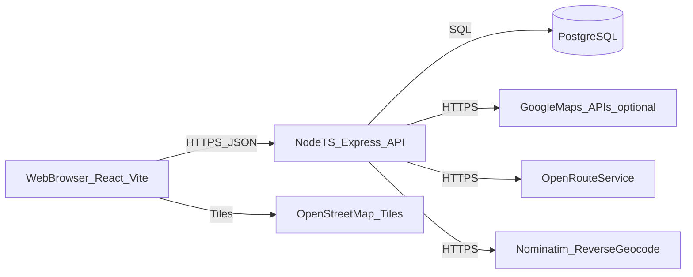
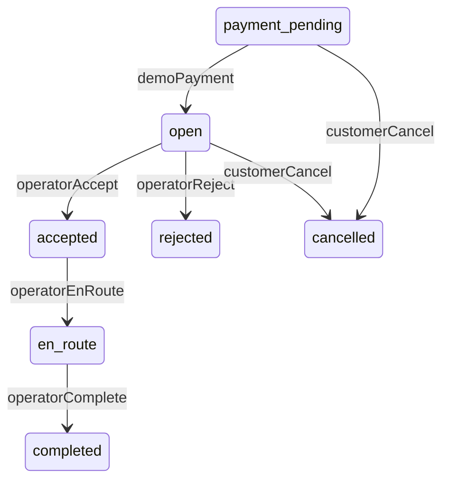
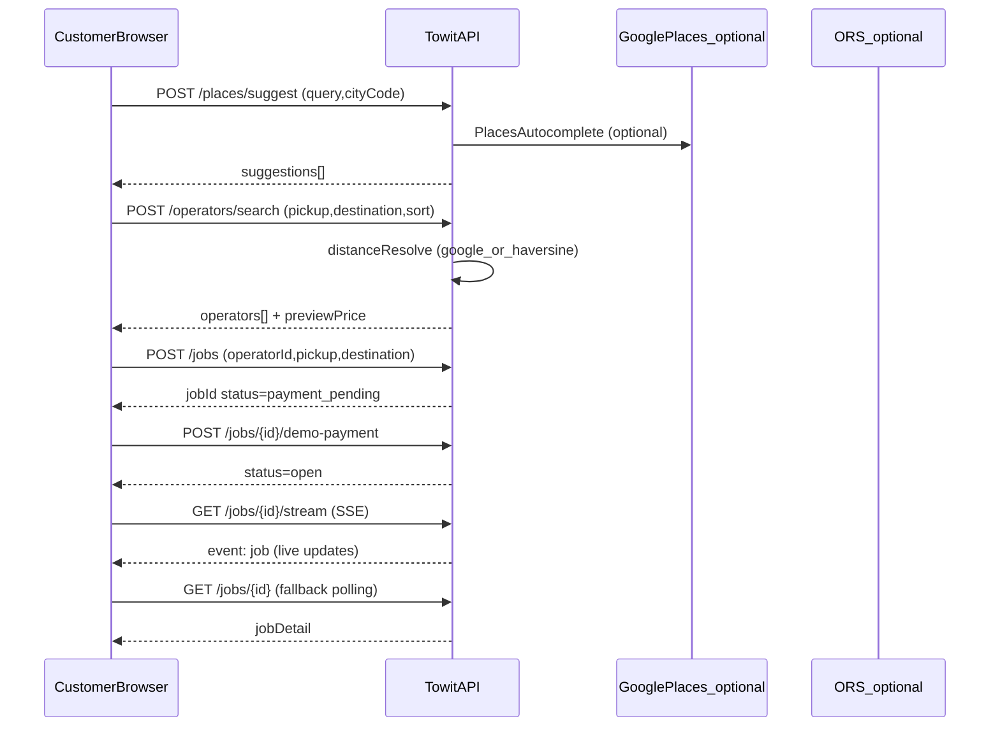
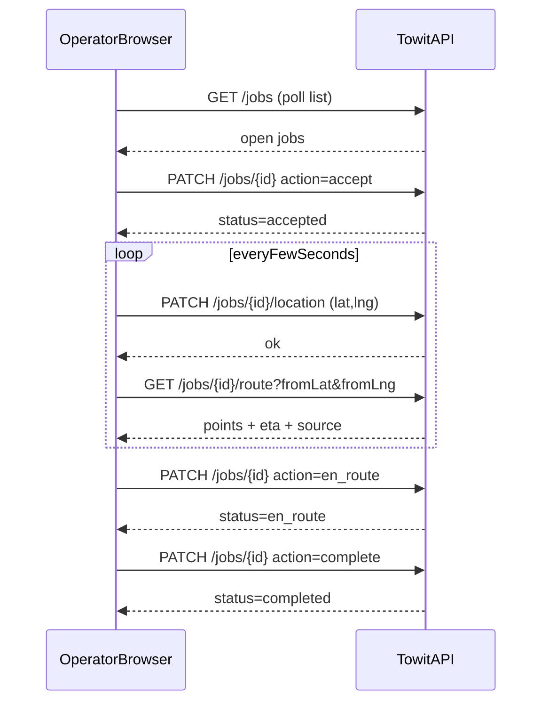

# Towit — SDLC Tasarım Dokümanı (MVP + Next)

Bu doküman, Towit’in mevcut MVP uygulamasını (**as-is**) SDLC “Design” aşaması seviyesinde tanımlar ve bir sonraki faz (push/chat/ödeme/admin/observability/redis) için tasarım yönünü netleştirir.

## İçindekiler
- [1. Bağlam ve hedefler](#1-bağlam-ve-hedefler)
- [2. Sistem genel mimarisi](#2-sistem-genel-mimarisi)
- [3. Backend tasarımı (`apps/server`)](#3-backend-tasarımı-appsserver)
- [4. Frontend tasarımı (`apps/web`)](#4-frontend-tasarımı-appsweb)
- [5. Veri modeli (PostgreSQL/Prisma)](#5-veri-modeli-postgresqlprisma)
- [6. İş akışları ve durum makinesi](#6-iş-akışları-ve-durum-makinesi)
- [7. API sözleşmeleri](#7-api-sözleşmeleri)
- [8. NFR: güvenlik, performans, gözlemlenebilirlik](#8-nfr-güvenlik-performans-gözlemlenebilirlik)
- [9. Dağıtım (staging/production)](#9-dağıtım-stagingproduction)
- [10. Next faz tasarımı](#10-next-faz-tasarımı)
- [11. Riskler ve açık konular](#11-riskler-ve-açık-konular)

## 1. Bağlam ve hedefler
### 1.1 Ürün bağlamı
Towit, yolda kalan sürücüyü (müşteri) uygun bir çekici (operatör) ile eşleştiren web tabanlı bir platformdur. MVP’de:
- Müşteri konum/varış seçer, çekicileri listeler ve demo ödeme ile talebi “açık” hale getirir.
- Çekici talebi kabul/ret eder, durumu günceller ve canlı konum gönderir.
- Harita/rota; mümkün olduğunca gerçek yol ağı ve trafik bilgisi ile, değilse yedek strateji ile üretilir.

Referanslar:
- Ürün kararları: `docs/MVP_SCOPE.md`
- Gereksinimler: `Towit_SRS.md`
- Kabul kriterleri: `docs/ACCEPTANCE_CHECKLIST.md`
- API: `apps/server/openapi.yaml`

### 1.2 Tasarım hedefleri
- **Güvenli anahtar yönetimi**: Harita sağlayıcı anahtarları yalnızca sunucuda.
- **Deterministik iş kuralları**: Job durumları ve geçişleri net; yasak geçişler 409 ile.
- **Kota ve maliyet yönetimi**: Places/Directions gibi dış çağrılarda rate-limit + cache.
- **Gözlemlenebilirlik temeli**: Kullanıcıya genel hata, sunucuda ayrıntılı log (NFR-09).
- **Evrilebilir mimari**: Push/chat/ödeme/admin gibi fazlar için genişletilebilir iskelet.

## 2. Sistem genel mimarisi
### 2.1 Konteyner görünümü



Notlar:
- Web, harita görselleştirmede Leaflet + OSM tile kullanır; API anahtarı zorunlu değildir.
- API, gerekirse Google Directions (trafik) / Places / Distance Matrix kullanır; yoksa yedek davranışlar devreye girer.
- ORS, gerçek yol ağı rotası için kullanılır; rate-limit + cache vardır.

### 2.2 Repoda yapı (monorepo)
- `apps/server`: Express + TypeScript + Prisma (PostgreSQL)
- `apps/web`: Vite + React + TypeScript
- Root `package.json`: workspaces; `dev`, `typecheck`, `test`, `db:*` script’leri

## 3. Backend tasarımı (`apps/server`)
### 3.1 Giriş noktaları ve routing
- App wiring: `apps/server/src/app.ts`
- Routerlar:
  - `/auth`: kayıt, giriş, refresh, verify
  - `/me`: oturumdaki kullanıcı
  - `/cities`: statik şehir kodları
  - `/places/*`: varış önerileri ve çözümleme
  - `/operators/*`: operatör arama (müşteri) ve profil/tarife güncelle (çekici)
  - `/jobs/*`: job CRUD + durum geçişleri + rota uçları + canlı konum
  - `/directions`: iki nokta rota önizlemesi
  - `POST /jobs/:id/review`, `GET /operators/:id/reviews`: puanlama

### 3.2 Kimlik doğrulama ve yetkilendirme
- **Model**: JWT access + refresh.
- Web tarafı: `apps/web/src/lib/api.ts` access ile çağrı yapar; `401` alırsa refresh deneyip tekrarlar.
- Server tarafı: middleware `requireAuth` ve rol kontrolleri (`requireRole`) ile korunur.

### 3.3 Hata sözleşmesi
API hata cevabı (tüm uçlarda tutarlı):

```json
{
  "error": { "code": "SOME_CODE", "message": "İnsan-okur mesaj", "details": "opsiyonel" }
}
```

Örnek kodlar:
- `VALIDATION_ERROR`, `INVALID_COORDINATES`, `NOT_FOUND`
- `CONFLICT_OPEN_JOB` (müşteri aynı anda ikinci aktif job açamaz)
- `INVALID_STATE_TRANSITION` (durum geçişi geçersiz)
- `RATE_LIMITED` (429)
- `ALREADY_REVIEWED` (aynı job için ikinci değerlendirme)

### 3.4 Rate limiting (kota koruma)
Amaç: brute-force’u azaltmak ve dış API kotasını korumak (NFR-05).
- Auth: IP+path başına ~10/dk
- Places: ~60/dk
- Directions: ~90/dk

> Not: Mevcut limiter process içi bellek kullanır; yatay ölçeklemede Redis’e taşınmalıdır (bkz. Next faz).

### 3.5 Doğrulama (validation) yaklaşımı
- Request body doğrulaması **Zod** ile yapılır.
- Tekrarlayan `safeParse` bloklarını azaltmak için bazı routerlarda `validateBody(schema)` middleware’i kullanılır (örn. `apps/server/src/routes/auth.ts`, `apps/server/src/routes/places.ts`).

### 3.6 Harita/rota stratejisi (routing)
`apps/server/src/services/directions.ts` içinde amaç “gerçek rota” üretmektir:
- **Öncelik 1**: Google Directions (trafik) — `GOOGLE_MAPS_API_KEY` varsa
- **Öncelik 2**: ORS directions — gerçek yol ağı; cache + rate limit
- **Yedek**: düz hat + ortalama hız ile süre (son çare)

ORS için (MVP):
- 10dk TTL cache (yaklaşık 111m koordinat yuvarlama ile)
- 60 saniyelik pencere rate-limit (40/dk planın altında güvenli marj)

## 4. Frontend tasarımı (`apps/web`)
### 4.1 Route yapısı
`apps/web/src/App.tsx`:
- `/login`, `/register`
- `/customer`, `/customer/jobs/:id`
- `/operator`, `/operator/jobs/:id`, `/operator/jobs/:id/rota`

### 4.2 Katmanlar ve modüller
- `src/lib/*`: API istemcisi, auth/localStorage, geo/haversine, geocode, jobStatus, vb.
- `src/hooks/*`: polling ve canlı konum izleme
- `src/pages/*`: rol bazlı ekranlar
- `src/components/*`: layout, map, feedback UI bileşenleri

### 4.3 UI akışları (özet)
Kaynak: `docs/UX_FLOWS.md`.

## 5. Veri modeli (PostgreSQL/Prisma)
Kaynak: `apps/server/prisma/schema.prisma`.

Temel varlıklar:
- `User` (role: `customer` | `operator`)
- `OperatorProfile` (aktiflik, hizmet merkezi + yarıçap, tarifeye bağlı)
- `Tariff` (taban + km ücreti)
- `Job` (pickup/dest, operator/customer ilişkisi, `JobStatus`, live konum alanları)
- `Review` (job başına tek; 1..5 rating + opsiyonel yorum)
- `RefreshToken` (hash saklama)

## 6. İş akışları ve durum makinesi
### 6.1 Job durum makinesi



Kurallar (MVP):
- Müşteri, aktif job varken yeni job açamaz: `payment_pending/open/accepted/en_route` bloklar (FR-14).
- İptal, kabul öncesinde mümkündür: `payment_pending` ve `open` (MVP_SCOPE ile uyum).
- Review yalnızca `completed` iş için ve yalnızca 1 kez.

### 6.2 Sequence: müşteri talep oluşturma



### 6.3 Sequence: çekici kabul + canlı konum + rota



## 7. API sözleşmeleri
Kaynak (tek gerçek referans): `apps/server/openapi.yaml`.

### 7.1 Endpoint grupları (özet)
- **Auth**: `POST /auth/register`, `POST /auth/login`, `POST /auth/refresh`, `GET /auth/verify`
- **Lookup**: `GET /cities`, `POST /places/suggest`, `POST /places/resolve`
- **Operators**: `POST /operators/search`, `PUT /operators/me`, `GET /operators/{id}/reviews`
- **Jobs**:
  - `GET/POST /jobs`
  - `GET/PATCH /jobs/{id}`
  - `GET /jobs/{id}/stream` (SSE: job snapshot events)
  - `POST /jobs/{id}/demo-payment`
  - `PATCH /jobs/{id}/location`
  - `GET /jobs/{id}/route`, `GET /jobs/{id}/route-to-destination`
  - `POST /jobs/{id}/review`
- **Directions**: `GET /directions?fromLat&fromLng&toLat&toLng`

## 8. NFR: güvenlik, performans, gözlemlenebilirlik
### 8.1 Güvenlik
- TLS: üretimde HTTPS zorunlu (NFR-01), öneri: reverse proxy (Caddy/nginx).
- Parolalar: hash’li saklanır (NFR-02).
- Harici anahtarlar: yalnızca server `.env` (NFR-03).
- Brute-force: auth rate limit (MVP).

### 8.2 Performans ve kota
- Operatör araması tipik yükte birkaç saniye hedefi (NFR-04).
- Places/Directions için rate-limit + cache (NFR-05).

### 8.3 Gözlemlenebilirlik
- Kullanıcıya genel 500 mesajı, server loglarında teknik ayrıntı (NFR-09).
- Next faz: requestId, structured logs, trace/metrics (bkz. 10. bölüm).

## 9. Dağıtım (staging/production)
Kaynak: `docs/STAGING.md`.

Özet:
- Web statik dosyalar (Vite build) reverse proxy ile sunulur.
- API aynı origin üzerinden `/api` ile proxylenebilir (önerilir) veya ayrı domain + CORS.
- DB migration: `npm run db:migrate -w apps/server`

## 10. Next faz tasarımı
Bu bölüm, MVP’nin üzerine eklenecek ana kabiliyetleri ve önerilen teknik yaklaşımı tanımlar.

### 10.1 Push bildirim (müşteri/operatör)
Hedef: job status değişimlerinde kullanıcıyı anında haberdar etmek (polling’i azaltmak).
- Seçenek A (web): Web Push + Service Worker
- Seçenek B (hibrit): SMS/e-posta sağlayıcı ile
Tasarım notları:
- Sunucuda “event” üretimi (job status transition sırasında).
- Client tarafı abonelik saklama (DB: `PushSubscription` tablosu) ve yeniden deneme stratejisi.
- Uygulama içinde “notification preferences” (sessiz saatler, sadece kritik durumlar) eklenebilir.

### 10.2 Gerçek zamanlı chat
Hedef: aktif job üzerinde müşteri ↔ operatör mesajlaşması.
- Transport: WebSocket (örn. socket.io) veya SSE (tek yönlü + ayrı POST message).
- Yetki: `jobId` bazlı; sadece job’ın customer’ı ve operator’ü.
- Veri modeli önerisi:
  - `Conversation(id, jobId unique, createdAt)`
  - `Message(id, conversationId, senderUserId, text, createdAt, readAt)`
- API önerisi (SSE varyantı):
  - `POST /jobs/{id}/messages`
  - `GET /jobs/{id}/messages?cursor=...`
  - `GET /jobs/{id}/events` (SSE: status + message event stream)

### 10.3 Gerçek ödeme entegrasyonu
Hedef: demo ödeme yerine PSP ile tahsilat + webhook doğrulama.
Öneriler:
- Idempotency key (jobId + attempt)
- Webhook ile `payment_pending -> open` geçişini finalize etmek
- `Payment` tablosu: `provider`, `status`, `amount`, `currency`, `providerRef`, `createdAt`
- State update kuralı:
  - Başarılı ödeme olmadan job “open” olmamalı (webhook doğrulaması tek kaynak).
  - `payment_pending` için otomatik zaman aşımı (örn. 10dk) ve `cancelled` (opsiyonel).

### 10.4 Admin panel ve operasyon
Hedef: operatör doğrulama, şikayet/uyuşmazlık, kota/anahtar yönetimi.
- RBAC: `admin` rolü veya ayrı servis.
- Audit log (değişiklik izleme) önerilir.
- Operatör “aktifleşme” süreci:
  - MVP’de `OperatorProfile.isActive` manuel; next fazda admin onayı ile yönetilebilir.

### 10.5 Redis ve arka plan işler
Hedef: rate-limit/caching’in dağıtık hale gelmesi ve event-driven işlem.
- Rate-limit bucket’larını Redis’e taşıma
- Places/Directions cache’i Redis’e alma
- Kuyruk: BullMQ vb. ile bildirim/işleme
- Background job örnekleri:
  - expired payment_pending cleanup
  - push notification fan-out
  - geocode caching warmup (sık noktalar)

### 10.6 Observability (OTel)
Hedef: request tracing + metrikler + alarm.
- requestId middleware
- OpenTelemetry SDK + exporter (Grafana/Jaeger/Tempo)
- API latency ve dış servis hata oranı metrikleri

### 10.7 Ölçeklenebilirlik: polling’den event’e geçiş
MVP, job durum güncellemelerinde ağırlıklı olarak **polling** kullanır. Next fazda:
- Müşteri/operatör sayfalarında polling aralığını adaptif hale getir (aktif job varken sık, değilken seyrek).
- Event stream (SSE/WebSocket) ile aktif job için anlık güncelleme sağlayıp polling’i yedek (fallback) olarak bırak.

## 11. Riskler ve açık konular
- **Dış servis kotası/ToS**: ORS/Google limitleri; üretimde maliyet/kota takibi şart.
- **Konum verisi (KVKK)**: saklama süresi, maskeleme, silme süreçleri tasarlanmalı.
- **Yatay ölçek**: in-memory cache/ratelimit ölçeklenmez; Redis’e taşınmalı.
- **Gerçek zamanlılık**: polling yerine push/websocket’e geçişte altyapı ve güvenlik yükü artar.

